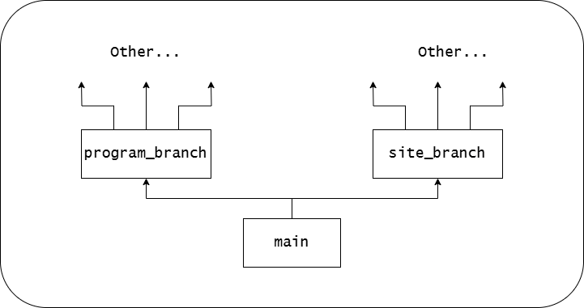

# computer_calculation

## Структура цього репозиторію

Існують всього 3 основні гілки: main, program_branch та site_branch.

1. main - являється основною гілкою, основна задача якої брати початок для спеціалізованих гілок program_branch та site_branch
2. program_branch - спеціалізована гілка, на якій розміщений суто код для console та gui програм. На ній працюватимуть: [artem](https://github.com/davidchyk), [max](https://github.com/MasterGun2006), [andrey](https://github.com/coffer-45), [ivan](https://github.com/VanDiesel123)
3. site_branch - спеціалізована гілка, на якій розміщений суто код для сайту. На ній працюватимуть: [danya](https://github.com/DanyaYen), [artem](https://github.com/davidchyk)

Граф структури репозиторія:

Також можна ознайомитись з ліцензією:

[LICENSE](LICENSE)
